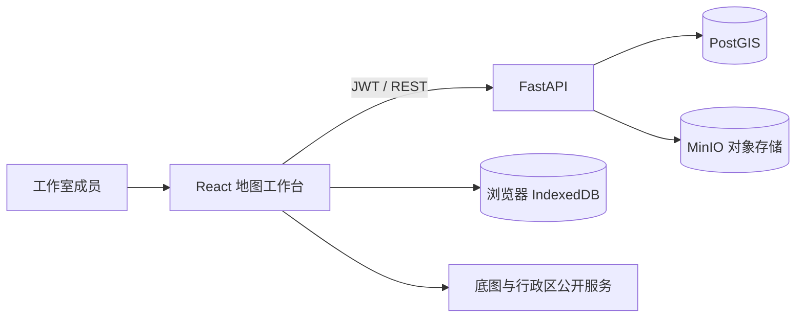

# 系统架构与数据流

## 组件关系



- PostGIS 保存用户、工作空间、成员关系、数据集元数据、样式、包络范围和行政区几何。
- MinIO 保存原始上传文件、规范化 GeoJSON 预览和 WGS84 Cloud Optimized GeoTIFF 预览。
- IndexedDB 支撑不登录的本地工作台；本地文件不会上传。
- 前端按需加载 Shapefile 与 GeoTIFF 解析器，登录页不承担 GIS 依赖的下载成本。

## 上传数据流

1. 前端校验扩展名并允许逐文件修改名称和 EPSG。
2. API 校验工作空间角色与文件大小。
3. 矢量数据由 GeoPandas 读取、修复几何并转换为 EPSG:4326；提取字段、统计量、范围和要素数。
4. 栅格数据由 Rasterio 重投影为 EPSG:4326，并生成压缩 COG 预览与像元统计。
5. 原文件和预览写入 MinIO，元数据及空间包络写入 PostGIS。
6. 地图按数据类型获取 GeoJSON 或 GeoTIFF 预览并渲染。

## 空间识别

双击地图后，服务端使用行政区空间索引找到最小覆盖行政区，再通过 `ST_Intersects` 返回与该区域相交的数据集。未导入行政区边界时会退化为点击点与数据包络的相交查询。本地模式在浏览器内用 Turf 和缓存边界完成同样流程。

初始化边界：

```bash
docker compose exec api python3 scripts/seed_admin_regions.py
```

## 权限模型

| 角色 | 浏览/制图/下载 | 上传/改名/保存样式/删除 | 成员管理 |
|---|---:|---:|---:|
| owner | 是 | 是 | 是 |
| editor | 是 | 是 | 否 |
| viewer | 是 | 否 | 否 |

所有数据集 API 均先检查当前用户在目标工作空间中的成员关系。JWT 默认有效期为 24 小时，可通过环境变量调整。

## 主要接口

| 方法 | 路径 | 用途 |
|---|---|---|
| POST | `/api/auth/register` | 注册并创建首个工作空间 |
| POST | `/api/auth/login` | 登录 |
| GET | `/api/workspaces` | 当前用户的工作空间 |
| GET/POST | `/api/workspaces/{id}/members` | 查看或添加成员 |
| GET/POST | `/api/workspaces/{id}/datasets` | 搜索或上传数据 |
| PATCH/DELETE | `/api/datasets/{id}` | 修改元数据/样式或删除 |
| GET | `/api/datasets/{id}/preview` | 获取地图预览 |
| GET | `/api/datasets/{id}/download` | 下载原始文件 |
| GET | `/api/workspaces/{id}/identify` | 点击坐标的行政区与覆盖数据 |

完整请求模型和可交互调试页由 FastAPI 自动发布在 `/docs`。

## 存储与备份

- Postgres 数据卷：`postgres_data`
- MinIO 数据卷：`minio_data`
- 浏览器本地数据：当前浏览器配置目录中的 IndexedDB

删除共享数据集会同时删除数据库记录、源文件和预览。生产环境应对两个服务卷执行一致性备份，并定期进行恢复演练。

## 扩展路线

当前预览方式与原型保持一致，适合工作室常见的中小型规划数据。数据量增长后，可保持现有元数据和权限接口不变，逐步增加：

- PostGIS `ST_AsMVT` 矢量瓦片端点；
- COG HTTP Range 或 TiTiler 栅格瓦片；
- 后台任务队列、入库进度与失败重试；
- OIDC/企业统一登录、审计日志和对象存储版本控制。
